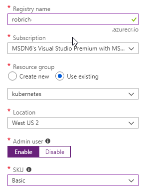

Install Azure resources
=======================


Azure Portal
------------

1. Sign up for a [free Azure trial](https://azure.microsoft.com/en-us/free/).  It requires a credit card for identity verification, but you won't be charged for the content you create.  After your trial, the content will get deleted unless you choose to upgrade to a paid account.

   If you already have an Azure account, you can use that instead.

2. Login to the [Azure Portal](https://portal.azure.com).


Create Kubernetes Cluster
-------------------------

1. Click `Create a resource`, type `Kubernetes` in the search box at the top, and choose `Kubernetes Service`.

   

2. In the Basics tab, fill in these options:

   - Create a new Resource Group (easy to delete the whole group at the end)

   - Name the resource group `kubernetes`

   - Enter a cluster name

   - Choose the region closest to you

   - Enter a DNS name prefix

   - Scroll down to see more content:

   - Change the Node Size to a cheaper VM -- I chose Standard B2s

   - Change the Node count to 1

   This will be a very under-powered Kubernetes cluster, but it'll also fit nicely in the Azure trial constraints.

   

3. In the Networking tab, ensure "http application routing" is enabled.

4. In the Monitoring tab, you can choose to enable monitoring for a nominal cost, or disable it to make the cluster cheaper.

5. Once you're done customizing the cluster, click the Review and Create tab, then click Create at the bottom.

6. This will take a bit to spin up.  You can watch the progress by clicking "All services" on the top-left.


Create Azure Container Registry
-------------------------------

Azure Container Registry is like Docker Hub, but the images aren't public to the internet.

(See also https://docs.microsoft.com/en-us/azure/aks/kubernetes-walkthrough-portal.)

You need not wait until the Kubernetes cluster is ready to begin creating this resource.

1. Click `Create a resource`, type `Container Registry` in the search box at the top, and choose `Container Registry`.

2. Setup the Azure Container Registry with these settings:

   - Choose a descriptive name

   - Use the existing resource group you created above

   - Choose the same location as the Kubernetes service

   - Enable the Admin user

   - You can choose to change the SKU to Basic or leave it at Standard.  See also https://docs.microsoft.com/en-us/azure/container-registry/container-registry-skus.

   

3. Push create at the bottom.

4. Once the registry is created, switch to the Access Keys tab, and note the Admin login and passwords.  From here, you can also randomly change the passwords.  We'll need these to login to the docker command-line.


Azure CLI
---------

We need the Azure CLI to wire up the connection between Azure Kubernetes Service and the `kubectl` Kubernetes command line, and to authorize communication between Azure Kubernetes Service and Azure Container Registry.

1. See https://docs.microsoft.com/en-us/cli/azure/install-azure-cli?view=azure-cli-latest for the steps to download and install the Azure CLI on your computer.

2. With the Azure CLI installed, run:

***
   ```
   az login
   ```
***

   It'll direct you to open a URL, paste in a code, and login to your Microsoft account.

3. If necessary, switch subscriptions with `az account list --output table` and [`az account set ...`](https://docs.microsoft.com/en-us/cli/azure/account?view=azure-cli-latest#az-account-set)

4. Run this command to login to kubectl:

***
   ```
   az aks get-credentials --resource-group kubernetes --name YOUR_CLUSTER_NAME
   ```
***

   Because I named my cluster `robrich` at the top of this exercise, I'll run `az aks get-credentials --resource-group kubernetes --name robrich`

5. The certificate details end up in `~/.kube/config`.  Open this file in a text editor and look around.

   Notice the `docker-for-desktop` configuration together with the Azure Kubernetes cluster.

   Now let's get the Kubernetes cluster logged into the registry.  (See also https://docs.microsoft.com/en-us/azure/container-registry/container-registry-auth-aks)

6. Run this command:

***
   ```
   az aks show --resource-group kubernetes --name YOUR_CLUSTER_NAME --query "servicePrincipalProfile.clientId" --output tsv
   ```
***

   This shows the service principal Azure created for the Kubernetes cluster.

7. Run this command to get the ACR id:

***
   ```
   az acr show --resource-group kubernetes --name YOUR_REGISTRY_NAME --query "id" --output tsv
   ```
***

   This shows the resource id for the Azure Container Registry.  It's very long.

8. Now let's use the two ids we harvested in the previous commands to assign permissions from Kubernetes to reach into the container registry.

***
   ```
   az role assignment create --assignee AKS_PRINCIPAL --role Reader --scope ACR_ID
   ```
***

   The `AKS_PRINCIPAL` is the result from step 6, and the `ACR_ID` is the result from step 7.


Switch clusters
---------------

1. The Azure cli switched us from `docker-desktop` to the Azure cluster.  In a command prompt, run:

***
   ```
   kubectl get all
   ```
***

   Notice the `frontend` and `backend` resources we created in previous sections aren't present in this server.

2. List all your contexts:

***
   ```
   kubectl config get-contexts
   ```
***

3. To switch to Docker's Kubernetes cluster, run:

***
   ```
   kubectl config use-context docker-desktop
   ```
***

   Now run `kubectl get all` and see the content we created previously.

4. Switch back to the Azure Kubernetes cluster:

***
   ```
   kubectl config use-context YOUR_NAME
   ```
***

   I typed `kubectl config use-context robrich`.
